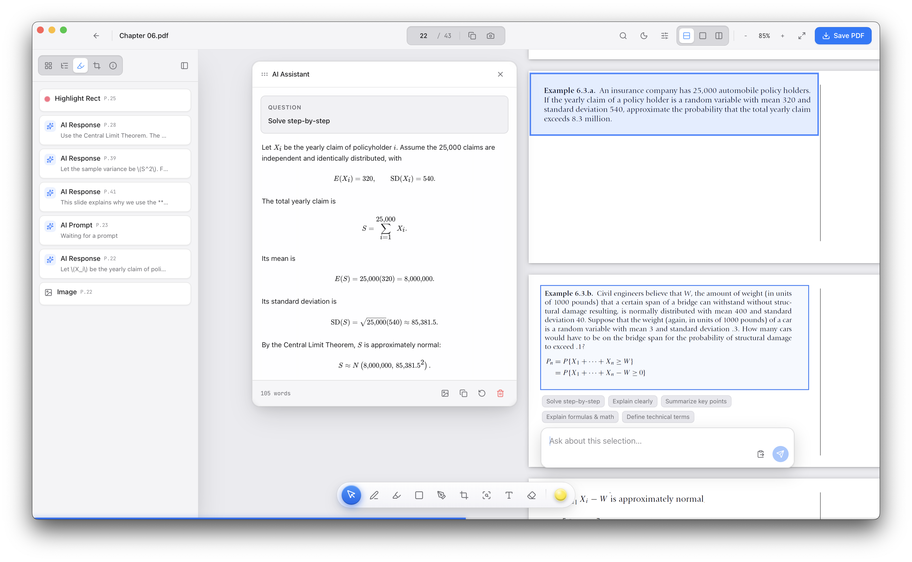

# Cinnabar

> Read, organize, annotate, and understand PDFs in one focused workspace.

  

Cinnabar is a desktop PDF reader made for focused reading, study, and review. It keeps your documents organized and gives you practical tools to work with their content without cluttering the reading experience.

## What it provides

- **Organize** — Find files, save favorites, and reopen recent reads.
- **Read your way** — Change the layout, zoom, colors, and brightness.
- **Mark and explain** — Highlight, draw, add notes, or ask for an explanation.
- **Capture and save** — Collect snippets, copy pages, and save your finished work.

Press `?` inside the app at any time to see all shortcuts and gestures.

## Contributing

Setup and contribution instructions are available in [DEVELOPMENT.md](DEVELOPMENT.md).
